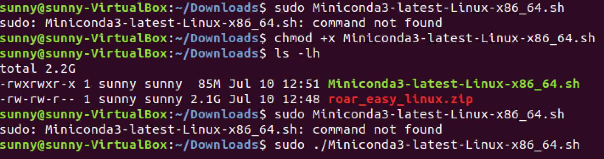

**Platforms Tested:** Ubuntu 18.04, Windows 10, MacOS Catalina
    
**Approximate Time:** ~10 minutes    

#### Windows
1. Clone the repo
    - `git clone https://github.com/augcog/ROAR-DeCal.git && cd ROAR-Decal`
2. Download Carla Server package
    - [Windows Download](https://drive.google.com/file/d/1TguaqwO9rPxCcOZ4DacJ_YQ5EoY1NJwz/view?usp=sharing)
    - put it OUTSIDE of the `ROAR-DeCal` folder, doesn't matter where
3. Download data
    - `./download_data.bat`
4. Check your file directory, it should be:
    - `ROAR-Sim`
        - `data`
            - `easy_map_waypoints.txt`
            - `... other data files`
        - `ROAR_simulation`
        - `runner.py`
        - ... other files and folders
5. Create virtual environment and install dependencies
    - `conda create -n ROAR python=3.7`
    - `conda activate ROAR`
    - `pip install -r requirements.txt`
6. Enjoy
    - `.CarlaUE4.exe` file in the Carla Server package to launch the server
    - `python runner.py`
        
#### Linux
1. Clone the repo
    - `git clone https://github.com/augcog/ROAR-DeCal.git && cd ROAR-Decal`
2. Download Carla Server package
    - [Linux Download](https://drive.google.com/file/d/1wU2mk5htapTEtyhsK4THIf1hp-OzvuN3/view?usp=sharing)
    - put it OUTSIDE of the `ROAR-Sim` folder, doesn't matter where
3. Download data
    - `./download_data.sh`
4. Check your file directory, it should be:
    - `ROAR-Sim`
        - `data`
            - `easy_map_waypoints.txt`
            - `... other data files`
        - `ROAR_simulation`
        - `runner.py`
        - ... other files and folders
5. Create virtual environment and install dependencies
    - `conda create -n ROAR python=3.7`
    - `conda activate ROAR`
    - `pip install -r requirements.txt`
6. Enjoy
    - `./CarlaUE4.sh` file in the Carla Server package to launch the server
    - `python runner.py`
    
    
#### Mac
1. Press and hold the Option (or Alt) ⌥ key during startup to switch to Windows.
2. Clone the repo
    - `git clone https://github.com/augcog/ROAR-DeCal.git && cd ROAR-Decal`
3. Download Carla Server package
    - [Windows Download](https://drive.google.com/file/d/1TguaqwO9rPxCcOZ4DacJ_YQ5EoY1NJwz/view?usp=sharing)
    - put it OUTSIDE of the `ROAR-DeCal` folder, doesn't matter where
4. Download data
    - `./download_data.bat`
5. Check your file directory, it should be:
    - `ROAR-Sim`
        - `data`
            - `easy_map_waypoints.txt`
            - `... other data files`
        - `ROAR_simulation`
        - `runner.py`
        - ... other files and folders
6. Create virtual environment and install dependencies on Anaconda Prompt
    - `conda create -n ROAR python=3.7`
    - `conda activate ROAR`
    - `pip install -r requirements.txt`
7. Enjoy
    - `CarlaUE4.exe` file in the Carla Server package to launch the server
    - `python runner.py`

### Common Errors
1. Conda not found 
    - You should download miniconda3 Linux/Windows 64-bit [miniconda3](https://docs.conda.io/en/latest/miniconda.html)
    - Follow the below instructions to install miniconda successfully 
    
    - If still cannot call conda, try (directory may vary):
        - `sudo chown -R /home/username/miniconda3/'`
        - `sudo chmod -R +x /home/username/miniconda3/`
