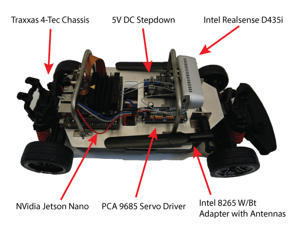

# **Technical Documentation for ROAR-Simulator**

<<<<<<< HEAD:docs/docs/index.md
For more information regarding DeCal Course visit [roardecal](https://roar-decal.github.io/ROAR.html).

=======
*Note: For more information regarding DeCal Course visit [Roar Decal](https://roar-decal.github.io/ROAR.html).*

>>>>>>> b6e17f5373ca1746cab801baae89bad6da23b471:docs/index.md

### **Getting Started**  
We use Carla which is an open-source simulator for autonomous driving research as our main demonstration of autonomous racing during COVID-19.

* If you are new to the project visit [GetingStarted](getting_started/quick_start.md)
* If you are curious about ROAR Competition at Berkeley visit [BerkeleyROAR](https://vivecenter.berkeley.edu/research1/roar/)
* If you are curious about Carla visit [CarlaSimulator](https://carla.org)

